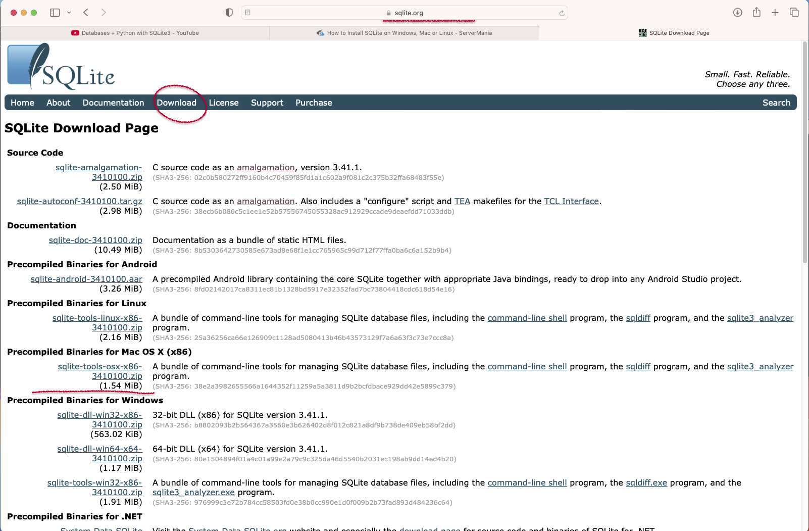

# SQLITE3

---
Download:

    

Precompiled Binaries for Mac OS X (x86) | https://sqlite.org/download.html

---

### beginner training ###

Open terminal in sqlite3 directory
    
    ❯ ../sqlite3/sqlite3 ../sqlite3/example.db
    
        sqlite> .databases
            main: ../sqlite3/example.db r/w
            
            sqlite> CREATE TABLE table1(fname text NOT NULL,lname text NOT NULL);
            sqlite> INSERT INTO table1 VALUES("John","Smith");
            sqlite> INSERT INTO table1 VALUES("Sam","Smith");
            sqlite> INSERT INTO table1 VALUES("Rick","Smithson");
            sqlite> INSERT INTO table1 VALUES("Rick","Johnson");
            sqlite> INSERT INTO table1 VALUES("Tim","Peterson");

### show tables

    sqlite> .tables
        COMPANY
        

    sqlite> SELECT * FROM table1;
        John|Smith
        Sam|Smith
        Rick|Smithson
        Rick|Johnson
        Tim|Peterson

    sqlite> SELECT * FROM table1 WHERE fname IS "Rick";
        Rick|Smithson
        Rick|Johnson

    
    sqlite> SELECT * FROM table1 WHERE lname LIKE "smith%";
        John|Smith
        Sam|Smith
        Rick|Smithson

    sqlite> SELECT rowid FROM table1;
        1
        2
        3
        4
        5

    sqlite> DELETE FROM table1 WHERE rowid=2;

    sqlite> SELECT rowid,* FROM table1;
        1|John|Smith
        3|Rick|Smithson
        4|Rick|Johnson
        5|Tim|Peterson
    

### keluar

    sqlite> .quit

    or

    sqlite> .exit

---

### Development with python ###

command terminal : 

    ❯ python3 -m venv venv

    ❯ source ./venv/bin/activate

install package python

    ❯ pip3 install db-sqlite3

projects:

├── 1_create_table.py

├── 2_insert_table.py

├── 3_retrieve_table.py

---

